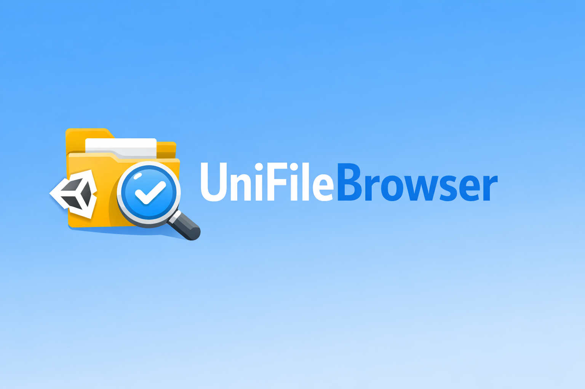

# UniFileBrowser

[](LICENSE)




## 🌀 概要
各プラットフォームに対応したファイルブラウザを表示する．

## 🌀 特徴

#### platform
- Standalone
  - Windows
  - Mac
  - Linux
  - Editor
- Web


## 🌀 セットアップ
#### 要件 / 開発環境
- Unity 6000.0

#### インストール

1. Window > Package ManagerからPackage Managerを開く
2. 「+」ボタン > Add package from git URL
3. 以下のURLを入力する
```
https://github.com/nitou-kanazawa/lib-unity-UniFileBrowser.git
```

あるいはPackages/manifest.jsonを開き、dependenciesブロックに以下を追記
```
{
    "dependencies": {
        "com.annulusgames.lit-motion": "https://github.com/nitou-kanazawa/lib-unity-UniFileBrowser.git"
    }
}
```


## 🌀 ドキュメント
